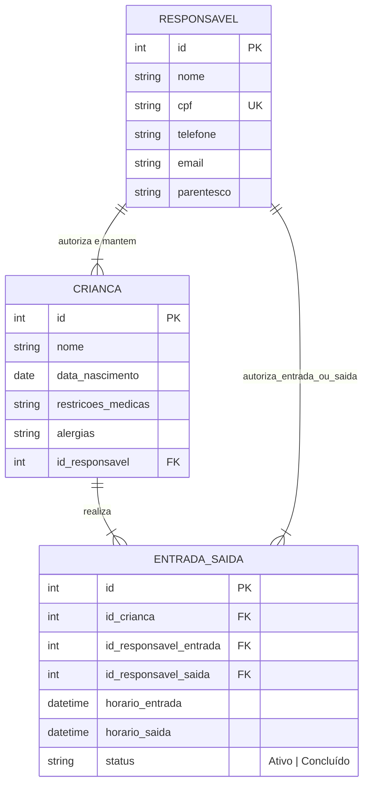

MER CadastroKIDS

```mermaid
erDiagram
    RESPONSAVEL ||--|{ CRIANCA : "autoriza e mantem"
    CRIANCA ||--|{ ENTRADA_SAIDA : "realiza"
    RESPONSAVEL ||--|{ ENTRADA_SAIDA : "autoriza_entrada_ou_saida"

    RESPONSAVEL {
        int id PK
        string nome
        string cpf UK
        string telefone
        string email
        string parentesco
    }

    CRIANCA {
        int id PK
        string nome
        date data_nascimento
        string restricoes_medicas
        string alergias
        int id_responsavel FK
    }

    ENTRADA_SAIDA {
        int id PK
        int id_crianca FK
        int id_responsavel_entrada FK
        int id_responsavel_saida FK
        datetime horario_entrada
        datetime horario_saida
        string status "Ativo | Concluído"
    }
```
